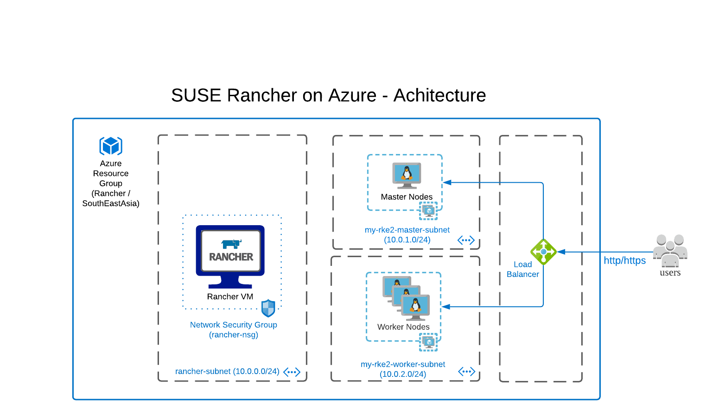

# Kubernetes Management with SUSE Rancher on Microsoft Azure
test

## Abstract and learning objectives

This is an in-depth workshops designed to give DevOps and IT teams the hands-on skills they need to deploy and manage Kubernetes everywhere with SUSE Rancher running on Microsoft Azure.

 

The content will be delivered by technical experts and aim to educate anyone interested in learning how to use containers or Kubernetes.

 

During these virtual hands-on workshops, our technical experts will provide an introduction to Rancher, Docker, and Kubernetes and then walk through the steps for deploying a Kubernetes cluster.

 

The key topics that will be covered at the workshop include:

- Docker and Kubernetes Concepts and Architecture
- Installation and Configuration of Rancher Server
- Kubernetes Cluster Deployment
- Application Deployment and Access

## Overview

TODO: Describe a scenario here.

## Solution architecture

This is what we are going to build in this workshop. We will create a resource group to contain the resources to be deployed in this workshop. Then, we will deploy Rancher Server as a VM within this resource group. We will then configure the Rancher Server to automate the provisioning of Kubernetes (based on RKE2) into the same resource group but different subnets. We will then explore some management and application deployment features in Rancher. 

## Agenda

 

09:15 – 09:30 – Introduction (15 mins)

- Workshop Objectives
- Docker and Kubernetes Overview

09:30 – 10:00 - Server Deployment

- Rancher Server Installation on Azure Instance
- Walkthrough of Rancher UI

10:00  – 11:00 - Kubernetes Deployment

- Provision Kubernetes on Azure Instances
- Exploring the Clusters with Rancher and the CLI

11:00 – 11:15 BREAK

11:15 – 12:15 – Securing and Managing Kubernetes Clusters

- Perform non-disruptive upgrade of Kubernetes clusters.
- Securing Kubernetes clusters.
- Monitoring Kubernetes clusters.

12:15 – 12:30 BREAK

12:30 – 13:15 – Cloud Native Application Deployment

- Deploying stateless Applications from the Catalog
- Enable cloud-native storage (longhorn) on the Kubernetes cluster.
- Deploying stateful Applications from the Catalog

13:15 - 13:30 - Q&A

 

## Having trouble?

First, verify you have followed all written lab instructions (including the Before the Hands-on lab document).

Next, submit an issue with a detailed description of the problem.

Do not submit pull requests. Our content authors will make all changes and submit pull requests for approval.

If you are planning to present a workshop, review and test the materials early! We recommend at least two weeks prior.

Please allow 5 - 10 business days for review and resolution of issues.

