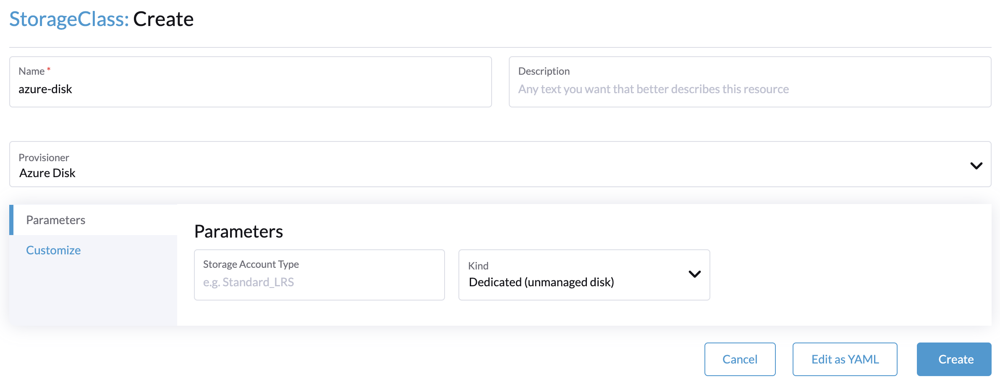
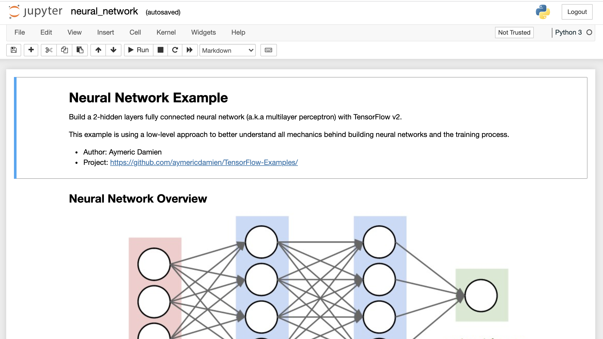
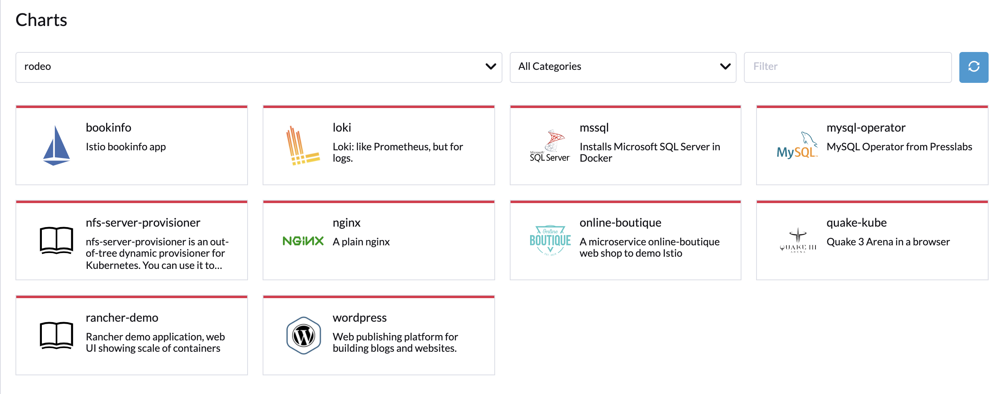
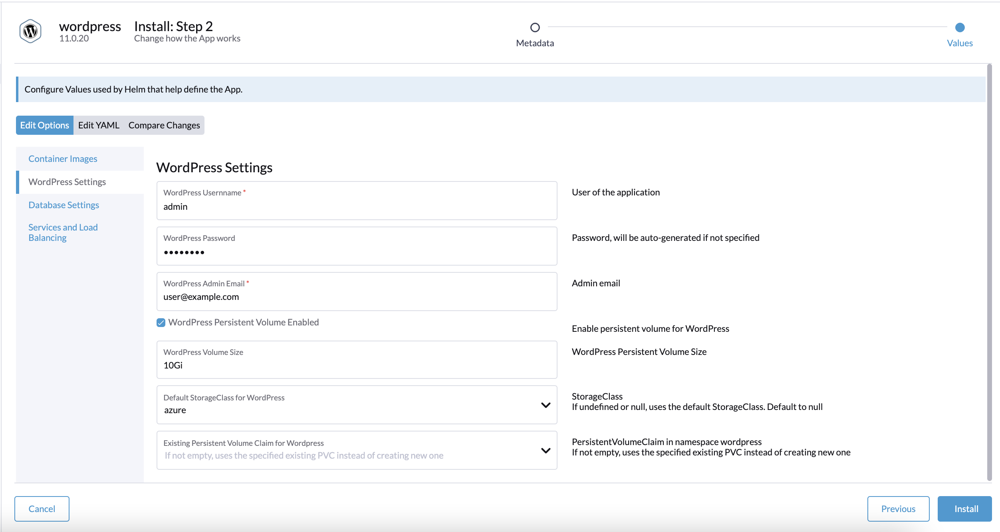
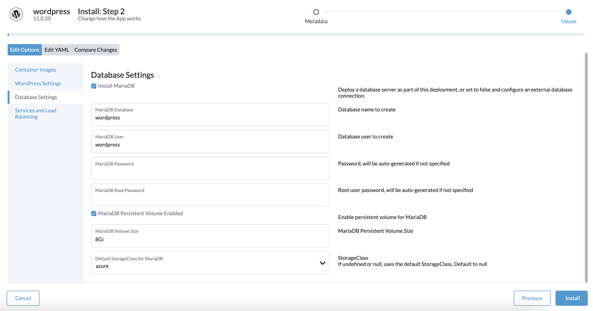

# Exercise 3: Deploying Apps on RKE 

Duration: 45 minutes

Now, we have got a RKE2 based Kubernetes cluster. Let's deploy a workload on it. In this lab, we are going to deploy two applications with two different approaches. 

The first application we are going to deploy is jupyter book to help AI/ML training on this RKE2 cluster with **Intel(R) Optimization for TensorFlow**, which is a binary distribution of TensorFlow with Intel(R) oneAPI Deep Neural Network Library (oneDNN) primitives, a popular performance library for deep-learning applications.  TensorFlow is a widely used machine-learning framework in the deep-learning arena, demanding efficient use of computational resources. To take full advantage of Intel(R) architecture and to extract maximum performance, the TensorFlow framework has been optimized using oneDNN primitives.

Then, we will deploy **Wordpress** on to the same RKE2 cluster, which stores its all data permanently on Azure Disk.

## Task 1: Interacting with the Kubernetes Cluster

In this step, we will be showing basic interaction with our Kubernetes cluster.

1. If you have not done this yet, navigate to **Cluster Management** from the left menu, observe the rke2 cluster on the list, click **Explore** button to open the **Cluster Explorer** page.

1. **Note the diagrams dials, which illustrate cluster capacity, and the box that show you the recent events in your cluster.**
2. Click the Kubectl Shell button (the button with the Prompt icon) in the top right corner of the Cluster Explorer, and enter kubectl get pods --all-namespaces and observe the fact that you can interact with your Kubernetes cluster using kubectl.
3. Also take note of the Download Kubeconfig File button next to it which will generate a Kubeconfig file that can be used from your local desktop or within your deployment pipelines.
4. In the left menu, you have access to all Kubernetes resources, the Rancher Application Marketplace and additional cluster tools.

## Task 2: Create a default Storage Class

In a Kubernetes Cluster, it can be desirable to have persistent storage available for applications to use. As we have already enabled a Kubernetes Cloud Provider for Azure in this cluster, we will be deploying the **Azure Disk** as data volumes, provided by **[Azure Storage](https://docs.microsoft.com/en-us/azure/aks/concepts-storage)**, to be used by containerized application running in a pod. 

1. In the left navigation menu, open **Storage**  >. **Storage Class** and then click **Create**
2. In the storage class form, please fill in the followings:
   1. Name: **azure-disk**
   2. Provisioner: **Azure Disk**
   3. Storage Account Type: **Standard_LRS** (Leave as default)
   4. Kind: **Dedicated (Unmanaged)** 
3. Keep all the settings as default, scroll to the bottom and click **Install**.
4. Once the new Storage Class is installed, go to **Storage** > **Storage Classes**
5. Observe the **azure-disk** storage class and choose the three-dot "..." menu to indicate it is the **Default** storage class.

## Task 3: Deploy Intel-Optimised Tensorflow with Jupyter Notebook

In this task, we will be creating a Kubernetes Deployment and Kubernetes Service for an Intel-optimized tensorflow workload. For the purposes of this lab, we will be using the container image `intel/intel-optimized-tensorflow:2.6.0-jupyter` but you can use your own container image if you have one for testing.

When we deploy our container in a pod, we probably want to make sure it stays running in case of failure or other disruption. Pods by nature will not be replaced when they terminate, so for a web service or something we intend to be always running, we should use a Deployment.

The deployment is a factory for pods, so you'll notice a lot of similairities with the Pod's spec. When a deployment is created, it first creates a replica set, which in turn creates pod objects, and then continues to supervise those pods in case one or more fails.

1. Under the Workloads sections in the left menu, go to **Deployments** and press **Create** in the top right corner and enter the following criteria:

   * Name - **intel**

   - Replicas - 1
   - Container Image - **intel/intel-optimized-tensorflow:2.6.0-jupyter**
   - Under **Ports** click **Add Port**
   - Under **Service Type** choose to create a **Node Port** service
   - Enter **8888** for the **Private Container Port**
   - **Note** the other capabilities you have for deploying your container. We won't be covering these in this lab, but you have plenty of capabilities here.

3. Scroll down and click **Create**

4. You should see a new **intel** deployment. If you click on it, you will see 1 Pod getting deployed.

4. From here you can click on a Pod, to have a look at the Pod's events. In the **three-dots** menu on a Pod, you can also access the logs of a Pod or start an interactive shell into the Pod.

5. Click on **View Logs** of the intel pod. You should notice the token shown in the log entry. Copy this token and you need it when you first time open the jupyter notebook to setup your own password.

6. In the left menu under **Service Discovery** > **Services**, you will find a new Node Port Service which exposes the Intel-Optimized tensorflow with jupyter application publicly on a high port on a node. You can click on the linked Port to directly access it.

## Task 4: Run a sample tensorflow code with Jupyter Notebook

Now, let's try to run some sample tensorflow code.

1. Click on the linked port to open the jupyter book in your browser. 

2. Upload a jupyter python book sample which can be downloaded from this sample notebook: https://raw.githubusercontent.com/aymericdamien/TensorFlow-Examples/master/tensorflow_v2/notebooks/3_NeuralNetworks/neural_network.ipynb. Save the content as `.ipynb` extension in your laptop computer.
3. Upload the above saved file into jupyter notebook.
4. Click Run button to execute the sample tensorflow code.

## Task 5: Add a new chart repository

Now, let's try the easiest way to install a complete Wordpress into our cluster, is through the built-in Apps Marketplace. In addition to the Rancher and partner provided apps that are already available. You can add any other Helm repository and allow the installation of the Helm charts in there through the Rancher UI.

1. In the left menu go to **Apps & Marketplace** > **Chart repositories**

2. Click on **Create** in the top right

3. Enter the following details:

4. - **Name** - rodeo
   - **Target** - Should be http(s) URL
   - **Index URL** - https://rancher.github.io/rodeo

5. Click on **Create**

6. Once the repository has been synchronized, go to **Apps & Marketplace** > **Charts**. There you will now see several new apps that you can install.

## Task 6: Creating Wordpress Project in your Kubernetes Cluster

Let's deploy a Wordpress instance into the cluster that uses the Azure Disk storage provider. First create a new project for it:

1. In the left menu go to **Cluster** > **Projects/Namespaces**

2. Click **Create Project** in the top right

3. Give your project a name, like wordpress

4. - Note the ability to add members, set resource quotas and a pod security policy for this project.

5. Next create a new namespace in the wordpress project. In the list of all **Projects/Namespaces**, scroll down to the wordpress project and click the **Create Namespace** button.

6. Enter the **Name** wordpress and click **Create**.

## Deploy Wordpress as a Stateful Application

In this step, we will be deploying Wordpress in the Kubernetes cluster. This wordpress deployment will utilize azure disk to store our mariadb data persistently.

1. From **Apps & Marketplace** > **Charts** install the **Wordpress** app

2. In step 1 of the install wizard, choose the wordpress namespace and give the installation the name wordpress

3. In step 2 of the install wizard, set:

4. - **Wordpress settings** > **Wordpress password** - to a password of your choice
   - Enable **Wordpress setting** > **Wordpress Persistent Volume Enabled**
   
   

   
   
   - Enable **Database setting** > **MariaDB Persistent Volume Enabled**
   
   
   
   
   
   - **Services and Load Balancing** > Uncheck "Expose app using Layer 7 Load Balancer", choose NodePort as Service Type and leave all the rest as default.

1. Scroll to the bottom and click **Install**.
2. It may take a few minutes to deploy wordpress in this lab, once the installation is complete, navigate to **Service Discovery** > **Services**. There you will see a new high port next to Wordpress service. Click on the URL to access Wordpress.
3. - *Note: You may receive* ***404\****,* ***502\****, or* ***503\*** *errors while the wordpress app is coming up. Simply refresh the page occasionally until Wordpress is available*
4. Note that you now have two Persistent Volumes available under **Storage** > **Persistent Volumes**
5. Log into Wordpress using your set admin credentials and create a new blog post. If you delete the **wordpress-mariadb** pod or click **Redeploy** now, your post will not be lost.

### Next steps

In this exercise, you deployed two different applications on RKE2 within Rancher Server, both manually or via a helm chart we added onto Rancher marketplace.

Now, you can move ahead to the [last exercise](./04-SecureAndManage-RKE.md) of the lab.

