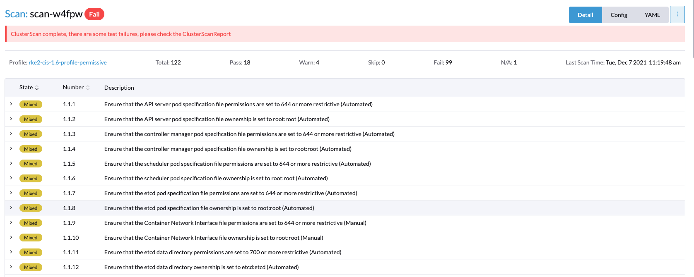

# Exercise 4: Managing Kubernetes within SUSE Rancher 

Duration: 45 minutes

At this point, we are going to bring in observability for the Kubernetes cluster managed by Rancher using open source tools governed by CNCF community, such as prometheus and grafana. Rancher made it easy to add this capability with just a few clicks.

Lastly, before going production, we want to ensure the Kubernetes cluster running the workloads are secure and meet the industry standard security baseline, such as the one from Center for Internet Security (CIS). We will see how Rancher made us productive in ensuring the cluster meet the security standard. 

## Task 1: Enable Rancher Monitoring

To deploy the *Rancher Monitoring* feature:

1. Click **Cluster Tools** button at the bottom of the left pane in Rancher Cluster Explorer View.

2. Locate the **Monitoring** chart, and click on it.

   

   

3. On the Monitoring App Detail page click the **Install** button in the top right

4. This leads you to the installation wizard. In the first **Metadata** step, choose **System** in the **Install into Project** option and click **Next**.

5. In the **Values** step, select the **Prometheus** section on the left. Change **Resource Limits** > **Requested CPU** from 750m to 250m and **Requested Memory** from 750Mi to 250Mi. This is required because our scenario virtual machine has limited CPU and memory available.

6. Click "**Install**" at the bottom of the page, and wait the helm install operation to complete. It may take a few minutes.
7. Once Monitoring has been installed, you can click on that application under "Installed Apps" to view the various resources that were deployed.

## Task 2: Working with Rancher Monitoring

Once Rancher Monitoring has been deployed, we can view the various components and interact with them.

1. In the left menu of the Cluster Explorer, select "Monitoring"
2. On the Monitoring Dashboard page, identify the "Grafana" link. Clicking this will proxy you to the installed Grafana server

1. Once you have opened Grafana, feel free to explore the various dashboard and visualizations that have been setup by default.

2. These options can be customized (metrics and graphs), but doing so is out of the scope of this exercise.

3. You will also see new Metrics and Alerts section on the Cluster page as well as on the individual workload pages.

## Task 3: Enable CIS Benchmark Scanning

In this task, we are going to scan the Kubernetes cluster to ensure its configured securely before running production workload on it.

1. From the bottom of the left menu pane, click **Cluster Tools**.
2. Locate **CIS Benchmark** and click **Install**
3. In Step 1, choose **System** as **Install into Project** option and click **Next** to continue.
4. Leave the setting as default in Step 2 and click **Install** to continue. It may take a few minutes to complete the installation.
5. Once installation is completed, **CIS Benchmark** menu will appear in the left menu pane. Expand it and click **Scan**.
6. Click Create button on the right to create a new CIS Benchmark scanning job. 

7. Leave the form as is to immediately run the scan once and click Create button to submit the job.
8. It takes a few minutes to complete the first scan. Once completed, you should be able to check the scan report which includes the remedial steps you need to take to harden the cluster.

### Next steps

That's the end of the workshop. Hope you enjoy it and do let us know what you think to make this better. If you are interested to explore further how SUSE Rancher can help your organization to transform your business digitally, please reach out to us.

